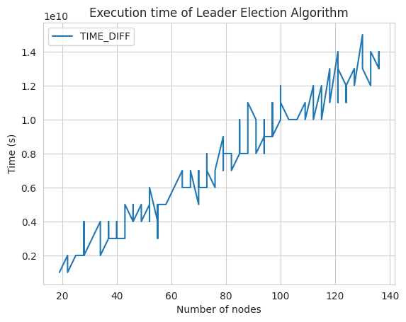

# Project Report
In this report, we explain the functioning and behavior of our assignment - the Leader Election As-Far-As-Possible algorithm in a circular topology. The solution uses gRPC framework for node communication.
Each node is represented as a separate CPU process that is behaving as both server and client. 

At start the string of values will be given. This will represent the IDs of circular topology and its size.
The program outputs logs of sent and received messages following this format: `<Node ID, Time, Sender ID, Receiver ID>`. 
Node ID is the ID of the node that records the message, the time value is the system (process) time immediately before sending the message or after receiving it, Sender ID is the node that sends the message, and Receiver ID is the ID of the node that receives the message.

For example, the message <24, 10:00:00, 11, 24> means that it was received and recorded by node 24 at 10:00:00. The message <24, 10:00:05, 24, 22> means that it was recorded by node 24 and sent from node 24 to node 22 at 10:00:05, and so on.

# As-Far-As-Possible LE Algorithm

The task of the algorithm is to find the node with the smallest `node_id` in a circular topology. At the beginning, all nodes in the topology are marked as *Candidates* for the leader position.

Each node initially sends its `node_id` to one of its neighbors (the direction for sending all messages is determined). If a node receives a larger `node_id` from its neighbor, it ignores it. However, if it receives a smaller `node_id`, it saves it, marks itself as *Defeated*, and forwards this `node_id` to its second neighbor.

If a node receives the same `node_id` as its own, it knows that it is the *Leader*. When a node receives this message, it means that the entire circle has been informed about its `node_id`, and they all acknowledge it as the smallest. Therefore, it becomes the leader, and all nodes are aware of its leadership.

# Implementation
The program was written in Python 3.X using gRPC technology. As input, it receives a string containing numerical `node_id` values in the order of the circular topology.

## Topology Creation

At the beginning, a *pivot* node is created, which is separated from the topology. The pivot is the only one who knows the entire size of the topology and is responsible for its proper initialization. After creating the pivot, individual nodes start to be created gradually. When a node is ready for communication, it sends an `alive_request` to the pivot. This request contains its `node_id`, allowing the pivot to determine who is ready for communication. Once all nodes are ready, the creation of the topology can continue.

```python
while pivot.get_is_all_ready() == False:
    pass
```

Each node is given information about itself, the pivot, and its two neighbors. This includes the *node_id*, *IP address*, and *port number* for connecting to the respective node. As the first step, the node initializes a gRPC server on which it listens for incoming messages. It then creates 2 threads through which it will communicate with its neighbors.

Once the node successfully creates the server and the client threads with its neighbors, it sends a message to the pivot node and waits for a response.

# Program Division
The program is divided into two files: [node](./node.py) and [main](./main.py).
`Node` contains all the classes and functionality necessary for creating the topology, while `Main` is responsible for running the entire program, setting up logging, and inserting the correct data into the circle.

## gRPC Services
From the perspective of gRPC, communication is divided into two services. The first service, `Owr`, contains functions called on nodes.
```protobuf
service Owr {
    rpc receive_message(owr_request) returns (owr_response) {}
    rpc receive_election_message(election_request) returns (election_response) {}
    rpc receive_termination_message(termination_request) returns (termination_response) {}
}
```
The second service, `Pivot`, contains a function called by prepared nodes and run on the pivot thread.
```protobuf
service Pivot {
    rpc receive_alive_message(alive_request) returns (alive_response) {}
}
```

## Connection
The Node module contains several classes: `Connection`, `PivotConnection`, and `NodeConnection`. They serve to simplify and abstract gRPC functionality from the main logic. This includes server initialization, stub creation, and message sending.

## PivotNode
As mentioned earlier, `PivotNode` is responsible for blocking the main program thread until all nodes in the topology are ready.

### receive_alive_message
When a node sends a message, the gRPC function `receive_alive_messsage` is activated. It saves the `node_id` and checks if it is the last node in the circle.
```python
def receive_alive_message(self, request, context):
    alive_node = request.nodeid
    self.nodes_ready.add(alive_node)
    self.is_all_ready = len(self.nodes_ready) == self.nodes_amount
    return owr_pb2.alive_response()
```

## Node
The `Node` class implements the ability to send basic messages as we did in exercises and also implements the Leader Election algorithm.

### receive_election_message
This gRPC function is called whenever a node receives a message related to the leader election algorithm. If the algorithm has not sent its `node_id` so far, the node will send it. If the received `node_id` is larger, it will ignore it. If it is smaller, it will set its `State` to `DEFEATED` and forward the message. If it is equal, it will set its `State` to `LEADER` and broadcast a termination message to all nodes.
This algorithm is defined in this method:
```python
def receive_election_message(self, request: owr_pb2.election_request, context):
    if not self.sent_em:
        direction = Direction(request.direction)
        self.sent_em = True
        self.inject_election_message(self.node_id, direction)
        return owr_pb2.election_response()
    
    if request.leading_node_id > self.node_id:
        return owr_pb2.election_response()
    
    if request.leading_node_id < self.node_id:
        self.state = State.DEFEATED
        direction = Direction(request.direction)
        self.leading_node_id = request.leading_node_id
        self.inject_election_message(request.leading_node_id, direction)
        return owr_pb2.election_response()

    if request.leading_node_id == self.node_id:
        self.state = State.LEADER
        self.leading_node_id = self.node_id
        # send the termination message to the next node
        self.inject_termination_message(self.node_id, Direction.NEXT)
        return owr_pb2.election_response()
```

### receive_termination_message
If a node is recognized as the smallest, it sends the termination message to its neighbor. Upon receiving this message, the neighbor saves it, marks that it received the termination message, and forwards it. This process continues until the termination message reaches the leader who sent it. The leader ignores the termination message. Thanks to this, the number of messages will always be *n + 1*.
## UML
Below is a simplified UML diagram for the overall `node.py` program:


# Execution
Create a virtual Python environment (optional):
```bash
$ python3 -m venv venv
$ source venv/bin/activate
```

Install all required libraries:
```bash
$ pip3 install -r requirements.txt
```

Run the program by inserting the topology string:

```bash
$ python3 main.py {topology_string}
```

If you want to generate new logs, you can run:
```bash
$ ./run.sh
```

If you need to regenerate gRPC files, use:
```bash
$ ./build.sh
```

# Outputs
## Logs
The logs are divided into two directories. `logs/` contains only the sent messages in the format defined in the [specification](#requirements-specification-for-the-semester-project). In the second directory, `debug_logs/`, debug-level logs are included, which provide more detailed information about what happened in the program, such as the type of message.

During the analysis, each sent message was also marked with a type: `ALIVE_MSG`, `ALGORITHM`, `TERMINATION`.
```
<22, 01:03:15, 21, 22> ALGORITHM
<23, 01:03:15, 22, 23> ALGORITHM
<24, 01:03:15, 23, 24> ALGORITHM
<25, 01:03:15, 24, 25> ALGORITHM
```
`ALIVE_MSG` messages are sent to the pivot node for initialization, and their number determines the total number of nodes in the topology.

`TERMINATION` messages are always sent at the end of the algorithm when the leader is found. They are sent through the entire circle until they are received again by the sender (leader), so their count is always *n + 1*.

These two types of messages have linear complexity and are not counted in the total number of sent messages. We consider only the messages necessary for determining the leader, marked with `ALGORITHM` label.

## Data
We ran our algorithm on 150 different topologies. Thanks to the labels, we were able to determine their sizes. We processed this data in the Jupyter notebook [data](./data.ipynb).

In the case of one-way synchronized As-Far-As-Possible Election algorithm, we can expect an average complexity of the number of messages in the circular topology to be Θ(n log n).

However, in our case, we send messages sequentially. This means that we have one *Initiator* who sends the first message to their neighbor, and then that neighbor sends the next message, and so on. In this case, we can expect an average linear complexity.

From our data of 150 iterations, we can see that the number of algorithm messages grows faster than the number of nodes but has a significantly lower number of messages than the Θ(n log n) complexity.


As we can see, the algorithm execution time also increases linearly.

