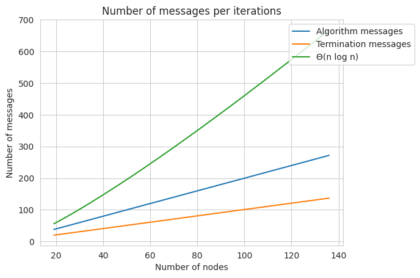

# Projektová správa 
V tejto správe vysvetlujeme fungovanie a správanie nášho zadania Leader election As-Far-As-Possible algoritmu v kruhovej topológií.

# Specifikace požadavků na semestrální práci
Pro řešení je vyžadováno použití frameworku gRPC od společnosti Google. Úvod do gRPC lze nalézt zde. Zvolený programovací jazyk pro implementaci závisí čistě na autorovi.

Řešení lze implementovat na jediném virtuálním počítači pomocí procesů/vláken, ale tyto procesy/threa/vlákna spolu musí komunikovat prostřednictvím gRPC.

Řešení bude obsahovat počáteční proces/vlákno, který spustí všechny komunikující procesy/vlákna.

Při spuštění programu bude z příkazového řádku předán jeden parametr řetězcové hodnoty představující kruhovou topologii uzlů s jejich ID.

Textový soubor obsahující předem vygenerované kruhové topologie lze stáhnout zde.

Simulace algoritmu musí obsahovat log soubor obsahující přehled odeslaných a přijatých zpráv. Formát zprávy by měl být <Node ID, Time, Sender ID, Receiver ID>. Node ID je ID uzlu, který zprávu zaznamenává, časovou hodnotou se rozumí systémový (procesní) čas bezprostředně před odesláním zprávy nebo po jejím přijetí, Sender ID je uzlu, který zprávu posílá a Receiver ID je ID uzlu, který zprávu obdrží.

Např. zpráva <24, 10:00:00, 11, 24> znamená, že byla přijata a zaznamenána uzlem 24 v čase 10:00:00. Zpráva <24, 10:00:05, 24, 22> znamená, že byla zaznamenána uzlem 24 a odeslána z uzlu 24 do uzlu 22 v čase 10:00:05 atd.

Implementace musí být průběžně ukládána na repozitář FIT’s Giltab z důvodu kontroly změn.

Povinnou součástí projektu je Projektová zpráva obsahující popis algoritmu (vlastními slovy), popis implementace (hlavní třídy, schéma UML atd.) a měření počtu zpráv pro minimálně 100 topologií zde. 

Měření bude obsahovat počet zpráv, které bylo nutné rozšířit kruhovou topologií k dosažení konečného stavu.Projektová zpráva musí být rovněž uložena v úložišti Gitlab.


# As-Far-As-Possible LE Algorithm 

Úlohou algoritmu je nájsť v kruhovej topológií uzol s najmenším `node_id`. Na začiatku sú všetky uzly v topológií označené ako *Kandidát* na lídra.
Každý uzol zo začiatku pošle `node_id` jednému svojmu susedovi (určíme na ktorú stranu sa budú posielať všetky správy). Ak uzol dostane od svojho suseda väčšie `node_id` ignoruje ho. V prípade, že dostane menšie uloží si ho, označí samého seba za *Porazeného* a pošle toto `node_id` ďalej druhému susedovi. 

V prípade, že dostane totožné id s tým svojim vie, že on je *Líder*. Ak dostal uzol túto správu, znamená to, že už celý kruh bol informovaný o jeho id a uznali ho za najmenšie. Tým pádom sa stáva lídrom a zároveň všetky uzly vedia, že je lídrom.

# Implementácia
Program bol napísaný v Python 3.X použitím technológie gRPC. Ako vstup dostane reťazec obsahujúci číselné ID hodnoty celého kruhu v poradí. 

## Vytvorenie topológie

Na začiatku sa vytvorí *pivot* uzol, ktorý je oddelený od topológie. Ten ako jediný vie celú veľkosť topológie a je zodpovedný za jej správnu inicializáciu. Po jeho vytvorení sa začnú postupne vytvárať jednotlivé uzly. Keď je uzol pripravený na komunikáciu pošle pivot-u `alive_request`. Tá obsahuje jeho `node_id`, vďaka čomu pivot vie určiť kto už je pripravený na komunikáciu. Potom čo sú všetky uzly pripravené môže tvorba topológie pokračovať.

```python
while pivot.get_is_all_ready() == False:
    pass
```

Každému uzlu dáme informáciu o sebe, pivot-u a jeho dvoch susedoch. To obsahuje *node_id*, *IP adresu* a *číslo portu* na ktorom sa dá s daným uzlom spojiť. Ako prvé si uzol incializuje gRPC server na ktorom bude počúvať prichádzajúce správy. Potom si vytvorí 2 vlákna cez ktoré bude komunikovať so svojimi susedmi.

Akonáhle uzol úspešne vytvorí server aj klientské vlákna so susedmi pošle správu pivot uzlu a čaká na správu.


# Rozdelenie programu
Program je rozdelený do dvoch súborov [node](./node.py) a [main](./main.py). 
`Node` obsahuje všetky triedy a funkcionalitu nutnú na tvorbu topológie. `Main` je zodpovedný za spustenie celého programu, nastavenie logovania a vloženia správnych dát do kruhu.

## gRPC služby
Komunikáciu sme z pohľadu gRPC rozdelily na dve služby. Owr obsahuje funkcie volané na uzloch.
```protobuf
service Owr {
    rpc receive_message(owr_request) returns (owr_response) {}
    rpc receive_election_message(election_request) returns (election_response) {}
    rpc receive_termination_message(termination_request) returns (termination_response) {}
}
```
Pivot funkcia je voľaná pripraveným uzlom a spúštaná na pivot vlákne. 
```protobuf
service Pivot {
    rpc receive_alive_message(alive_request) returns (alive_response) {}
}
```

## Connection
Node modul obsahuje viacero tried. `Connection`, `PivotConnection` a `NodeConnection` slúžia na 
zjednodušenie a abstrahovanie gRPC fungovania od hlavnej logiky. To obsahuje inicializáciu serveru, vytvorenie stub-u a posieľanie správ.

## PivotNode
Ako sme spomínali, `PivotNode` je zodpovedný za blokovanie hlavného vlákna programu do momentu, kedy sú všetky uzly v topológií pripravené. 

### receive_alive_message
V momente, kedy uzol pošle správu aktivuje sa gRPC funkcia `receive_alive_messsage`. Tá si uloží `node_id` a skontroluje, či sa nejedná o posledný uzol v kruhu.
```python
 def receive_alive_message(self, request, context):
        # this will run only on the pivot node
        alive_node = request.nodeid
        self.nodes_ready.add(alive_node)
        self.is_all_ready = len(self.nodes_ready) == self.nodes_amount
        return owr_pb2.alive_response()
```

## Node
`Node` trieda implementuje možnosť poslať základnú správu ako sme robili na cvičení a implementuje Leader Election algoritmus. 

### receive_election_message
Táto gRPC funkcia je volaná vždy, keď uzol zachytí správu týkajúcu sa líder algoritmu. V prípade, že algoritmus doteraz neposlal svoje `node_id` ho pošle. V prípade, že prijaté `node_id` je väčšie ignoruje ho. V prípade, že je menšie nastaví si svoj `State` na `DEFEATED` a pošle správu ďalej. V prípade, že sa rovná nastaví si `State` na `LEADER` a rozpošle všetkým správu o ukončení hľadania.
Tento algoritmus je definovaný v tejto metóde:
```python
    def receive_election_message(self, request: owr_pb2.election_request, context):
        if not self.sent_em:
            direction = Direction(request.direction)
            self.sent_em = True
            self.inject_election_message(self.node_id, direction)
            return owr_pb2.election_response()
        
        if request.leading_node_id > self.node_id:
            return owr_pb2.election_response()
        
        if request.leading_node_id < self.node_id:
            self.state = State.DEFEATED
            direction = Direction(request.direction)
            self.leading_node_id = request.leading_node_id
            self.inject_election_message(request.leading_node_id, direction)
            return owr_pb2.election_response()

        if request.leading_node_id == self.node_id:
            self.state = State.LEADER
            self.leading_node_id = self.node_id
            # send the termination message to the next node
            self.inject_termination_message(self.node_id, Direction.NEXT)
            return owr_pb2.election_response()
```

### receive_termination_message
V prípade, že uzol bol uznaný za najmenší pošle správu svojmu susedovi. Ten si po prijatí uloží, že dostal ukončujúcu správu a pošle ju ďaľej. Takto bude správa pokračovať, až dokým ju nedostane líder, ktorý ju odoslal. Ten ju ignoruje. Vďaka tomuto bude počet správ vždy *n + 1*.  

## UML
Zjednodušenú UML schému celkového `node.py` môžeme vidieť dole na obrázku.


# Spustenie
Vytvoríme si virtuálne Python prostredie (nepovinné):
```bash
$ python3 -m venv venv
$ source venv/bin/activate
```

Nainšťalujeme všetky dôležité knižnice
```bash
$ pip3 install -r requirements.txt
```

Program spustíme vložením reťazca topológie:

```bash
$ python3 main.py {reťazec}
```

V prípade, že chceme vygenerovať nové logy môžeme zavolať:
```bash
$ ./run.sh
```

V prípade nového vygenerovania gRPC súborov použijeme
```bash
$ ./build.sh
```

# Výstupy
## Logy
Logy sme rozdelily do dvoch adresárov. `logs/` obsahujú iba odoslané správy vo formáte, ktorý bol definovaný v [špecifikácií](#specifikace-požadavků-na-semestrální-práci). V druhom adresári `debug_logs/` sú mimo odoslaných správ zahrnuté aj logy na úrovni DEBUG módu. Tie obsahujú detailnejšie informácie toho, čo sa v programe stalo, ako napríklad o aký typ správy šlo.

Pri analýze sme si taktiež označili každú odoslanú správu podľa typu na: `ALIVE_MSG`, `ALGORITHM`, `TERMINATION`.
```
<22, 01:03:15, 21, 22> ALGORITHM
<23, 01:03:15, 22, 23> ALGORITHM
<24, 01:03:15, 23, 24> ALGORITHM
<25, 01:03:15, 24, 25> ALGORITHM
```
`ALIVE_MSG` sú správy, ktoré boli poslané pivot uzlu na inicializáciu a teda ich počet zároveň určuje celkový počet uzlov v topológií. 

`TERMINATION` správy sú vždy poslané na konci algoritmu, keď bol nájdený líder. Tie sa pošlú cez celý kruh, až dokým ju znovu nedostane odosielateľ (líder) a teda ich počet je vždý *n + 1*.  

Tieto dva typy správ majú teda lineárnu komplexitu a nie sú započítavané do počtu celkových odoslaných správ. Tými považujeme iba správy nutné na určenie lídra, teda správy s `ALGORITHM` označením. 

## Dáta
Náš algoritmus sme spustili nad 150timi topológiami. Vďaka označeniu sme vedeli zistiť ich počty. Tieto údaje sme následne spracovali v jupyter notebook-u [data](./data.ipynb).

Pri jednosmernom synchronizovanom As-Far-As-Possible Election algoritme môžeme očakávať priemernú komplexitu počtu správ kruhovej topológie Θ(n log n). 

Avšak v našom prípade posielame správy sekvenčne. To znamená, že máme jedného *Iniciátora*, ktorý odošle ako prvý správu susedovi a ten pošle ďalšiu atď. V tom prípade, môžeme očakávať priemernú lineárnu komplexitu. 

Z našich dát 150tich spustených iterácií môžeme vidieť, že počet správ algoritmu rastie rýchlejšie, ako počet uzlov, ale má podstatne menši počet správ ako komplexita Θ(n log n).



